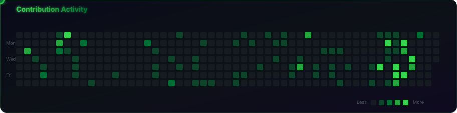
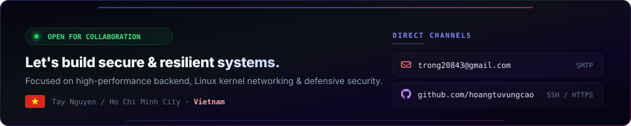

<!--
  GitHub Profile README — hoangtuvungcao/hoangtuvungcao
  Dynamic metrics auto-generated via GitHub Actions every 6 hours.
  Workflow: .github/workflows/generate-profile.yml
-->

<!-- HEADER -->
<div align="center">



<br/>

<a href="https://git.io/typing-svg">
  
</a>

<br/>

<p>
  <a href="https://github.com/hoangtuvungcao">
    
  </a>
  <a href="mailto:trong20843@gmail.com">
    
  </a>
</p>

<p>
  
  &nbsp;
  
  &nbsp;
  
</p>

</div>


<!-- ABOUT -->

## About

```yaml
# SYSTEM MANIFEST: hoangtuvungcao.sys
operator:
  handle:    hoangtuvungcao (Nguyen Van Trong)
  origin:    Tay Nguyen, Vietnam [12.6667° N, 108.0500° E]
  station:   Information Technology · Tay Nguyen University
  clearance: Defensive Security · Systems Engineering · DevOps

tactical_matrix:
  l7_defense:   High-concurrency WAF & reverse proxies in Go (Mango WAF)
  kernel_ops:   eBPF/XDP zero-copy packet filtering at network ingress
  tunneling:    Multi-protocol reverse tunnels (HTTP/S, TCP, UDP, WebDAV)
  intelligence: YOLOv8 neural diagnostics daemon + FastAPI + Gemini AI

doctrine:
  - "Never trust user input. Never trust default configurations."
  - "Drop malicious packets at kernel ingress before user-space overhead."
  - "Measure before optimizing. Design for rapid failure recovery."
  - "Automate repeatable toil. Document for incident response."
```

---

<!-- METRICS -->

## Metrics

<div align="center">

<a href="https://github.com/hoangtuvungcao">
  
</a>
&nbsp;
<a href="https://github.com/hoangtuvungcao">
  
</a>

<br/><br/>

<a href="https://github.com/hoangtuvungcao">
  
</a>

<br/><br/>

<a href="https://github.com/hoangtuvungcao">
  
</a>

</div>

---

<!-- SNAKE -->

## Contribution Activity

<div align="center">
  
</div>

---

<!-- TECH STACK -->

## Tech Stack

<div align="center">

**Core**

<a href="https://skillicons.dev">
  
</a>

<br/><br/>

**Systems and Security**

<p>
  
  
  
  
  
  
  
  
</p>

<br/>

**Additional**

<a href="https://skillicons.dev">
  
</a>

</div>

---

<!-- PROJECTS -->

## Featured Projects

<div align="center">
<table>
<tr>
<td width="50%" valign="top">

### [Mango WAF](https://github.com/hoangtuvungcao/mango-waf)

<p>
  <a href="https://github.com/hoangtuvungcao/mango-waf/stargazers">
    
  </a>
  <a href="https://github.com/hoangtuvungcao/mango-waf/network/members">
    
  </a>
  
</p>

Go-based Web Application Firewall and reverse proxy for protecting web applications from Layer 7 attacks. Request filtering, rate limiting, IP mitigation, Cloudflare-aware traffic handling.

`Go` `WAF` `Reverse Proxy` `eBPF/XDP` `Cloudflare`

<sub>[Repository](https://github.com/hoangtuvungcao/mango-waf) · [Documentation](https://github.com/hoangtuvungcao/mango-waf/tree/main/docs) · [Issues](https://github.com/hoangtuvungcao/mango-waf/issues)</sub>

</td>
<td width="50%" valign="top">

### [ProxVN Tunnel](https://github.com/hoangtuvungcao/proxvn_tunnel_full)

<p>
  <a href="https://github.com/hoangtuvungcao/proxvn_tunnel_full/stargazers">
    
  </a>
  <a href="https://github.com/hoangtuvungcao/proxvn_tunnel_full/network/members">
    
  </a>
  
</p>

Self-hosted tunneling platform in Go for exposing local services to the internet. Supports HTTP/HTTPS, TCP, UDP, and WebDAV without depending on third-party providers.

`Go` `Tunneling` `Docker` `Self-Hosted` `Networking`

<sub>[Repository](https://github.com/hoangtuvungcao/proxvn_tunnel_full) · [Documentation](https://github.com/hoangtuvungcao/proxvn_tunnel_full/tree/main/docs) · [Releases](https://github.com/hoangtuvungcao/proxvn_tunnel_full/releases)</sub>

</td>
</tr>
<tr>
<td width="50%" valign="top">

### [Leaf-Check AI](https://github.com/hoangtuvungcao/leaf-check-ai)

<p>
  
  
  <a href="https://github.com/hoangtuvungcao/leaf-check-ai/releases">
    
  </a>
</p>

AI-assisted agricultural platform for plant-leaf disease identification. YOLO-based image diagnosis, FastAPI backend, Flutter client, and Gemini-powered chatbot.

`Python` `FastAPI` `YOLO` `Flutter` `Gemini AI`

<sub>[Repository](https://github.com/hoangtuvungcao/leaf-check-ai) · [Documentation](https://github.com/hoangtuvungcao/leaf-check-ai/tree/main/docs) · [Releases](https://github.com/hoangtuvungcao/leaf-check-ai/releases)</sub>

</td>
<td width="50%" valign="top">

### [All Repositories](https://github.com/hoangtuvungcao?tab=repositories)

<p>
  
  
</p>

Explore more tools and projects around networking, security, infrastructure automation, and AI-assisted applications.

<br/>

[View all repositories →](https://github.com/hoangtuvungcao?tab=repositories)

</td>
</tr>
</table>
</div>

---

<!-- CURRENT FOCUS -->

## Current Focus

| Tactical Vector | Operational Objective |
| :--- | :--- |
| **Kernel Networking** | Zero-copy packet dropping with eBPF/XDP on Linux network drivers |
| **L7 WAF Architecture** | High-concurrency reverse proxying, token-bucket rate limiters & edge security |
| **Hardened Deployment** | Minimal attack-surface containers, immutable Linux nodes & reproducible builds |
| **Security Benchmarking** | Reproducible latency, throughput & error telemetry under adversarial load |
| **Automated Defense** | CI security auditing, supply-chain verification & anomaly detection |

---

<!-- PHILOSOPHY -->

## Engineering Philosophy

> *Build it. Measure it. Break it safely in the lab. Understand the failure mode. Harden the core. Iterate.*

<details>
<summary>System Principles</summary>
<br/>

| Principle | Doctrine |
| :--- | :--- |
| **Measure before optimizing** | Publish the benchmark environment, workload profile, p99 latency, and saturation points |
| **Design for recovery** | Automated health checks, deterministic rollback paths, safe fallback defaults |
| **State limits honestly** | Security mitigations reduce attack surface — they do not eliminate logic flaws |
| **Automate repeatable toil** | Builds, security linters, container packaging, and releases must be deterministic |
| **Document for operators** | Architecture topology, failure matrices, incident response & post-mortem procedures |

</details>

---

<!-- SECURITY -->

## Security and Responsible Disclosure

All security research, packet inspection tools, and proof-of-concept components are authored strictly for **defensive validation, laboratory testing, and educational research under responsible disclosure**. Root access and attack simulations must only occur within isolated testbeds or authorized environments.

---

<!-- OPPORTUNITIES -->

## Opportunities

| Operational Domain | Tactical Focus | Status |
| :--- | :--- | :--- |
| **Backend Engineering** | Go, Rust, Distributed Systems, High-Concurrency APIs | `ACTIVE // Open to Junior / Internship` |
| **DevOps & Platform Security** | Linux Hardening, Container Isolation, CI/CD Pipeline Security | `DEPLOYABLE // Available for projects` |
| **Defensive Security** | WAF Architecture, eBPF/XDP Filtering, Traffic Analysis | `ENGAGED // Active research` |
| **Open Source Tooling** | Tunneling Platforms, Network Tooling, Security Hardening | `COLLABORATING // Open to PRs & Collab` |

---

<!-- FOOTER -->

<div align="center">



<br/><br/>

<p>
  <a href="mailto:trong20843@gmail.com">
    
  </a>
  &nbsp;&nbsp;
  <a href="https://github.com/hoangtuvungcao">
    
  </a>
</p>

<br/>


<sub>Metrics auto-generated via GitHub Actions · Updated every 6 hours</sub>

</div>
